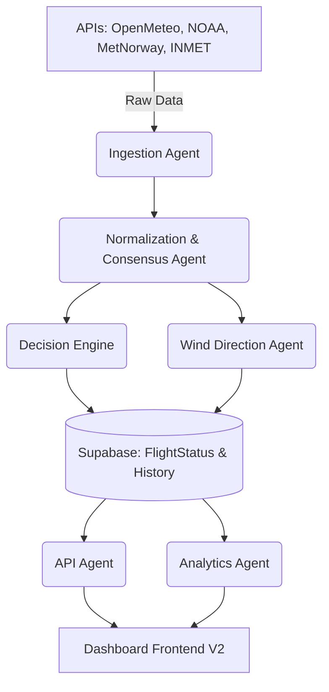

# 🤖 Arquitetura de Agents - Boituva Flight Ops v2

## 🎯 Objetivo

Dividir as responsabilidades do sistema em agentes especializados para garantir:
* Escalabilidade
* Clareza e Isolamento de Responsabilidades
* Manutenção Simples e Resiliência contra Falhas

---

## 🧠 Lista de Agents

### 1. Weather Ingestion Agent (`weather_ingestion.py`)
Responsável por coletar dados climáticos primários e secundários.
**Skills:**
* Consumir APIs em tempo real (Open-Meteo, Met Norway, NOAA GFS).
* Consumir APIs históricas (INMET) como contexto estendido.
* Tratar timeout/erro de forma independente (uma fonte não derruba as outras).
**Output:** Tabela `weather_raw` e passagem para o Consensus Engine.

### 2. Data Normalization Agent (`consensus_engine/engine.py`)
Padroniza dados entre as fontes e aplica a regra do "Pior Cenário" (Worst-Case Consensus).
**Skills:**
* Limpeza de dados nulos.
* Cálculo do `uncertainty_factor` baseado na divergência de fontes.
* Seleção conservadora do vento e rajada mais altos entre os modelos.
**Output:** Objeto normalizado com dados `consensus` para gravação na `weather_normalized`.

### 3. Decision Engine Agent (`decision_engine.py`)
O coração operacional do sistema focado em Balonismo.
**Skills:**
* Aplicar limiares estritos de segurança (vento > 12km/h, rajada > 15km/h, zero chuva).
* Calcular `risk_score` ponderado.
* Gerar justificativas (reasons) explicáveis em texto humano.
**Output:** Gravação na tabela `flight_status` (Bandeira Verde, Amarela ou Vermelha).

### 4. Wind Direction Agent (`wind_direction_agent.py`)
Especialista vetorial introduzido na V2.
**Skills:**
* Traduz graus meteorológicos (ex: 334º) para texto compreensível ("NO").
* Fornece o dado formatado para o front-end e bússolas UI.
**Output:** Rótulos cardinais.

### 5. API Agent (`api/routes.py`)
Exposição e serialização dos dados processados.
**Skills:**
* Criar endpoints REST padronizados (`/voo/status`, `/clima/atual`).
* Fornecer telemetria completa (breakdown de riscos e histórico das fontes).

### 6. Analytics Agent (`api/analytics.py`)
Responsável pela consolidação do passado para visibilidade no painel.
**Skills:**
* Consultas SQL complexas para agregações diárias.
* Geração de estatísticas globais (risco médio, número de cancelamentos, etc).
**Output:** Endpoints de `/analytics` alimentando gráficos da UI.

### 7. Alert Agent (Futuro)
Monitoramento ativo de degradação climática para push-notifications.
**Skills:**
* Detectar transições bruscas de Risco Médio para Crítico.
* Acionar Webhooks do Telegram / WhatsApp para os pilotos.

---

## 🔄 Fluxo entre Agents

---

## 🧠 Filosofia Adotada

* **Uma fonte quebra, o sistema continua:** A arquitetura nunca deve falhar catastroficamente por conta da indisponibilidade de um serviço externo.
* **Segurança extrema (Balonismo):** A agregação dos agentes favorece o cenário de pior caso. É preferível cancelar um voo por falso positivo (modelo pessimista) do que autorizar sob divergência e incerteza dos radares.
* **Módulos Independentes:** Se precisarmos adicionar o provedor de clima da Apple ou do CPTEC no futuro, basta plugar um novo método no Ingestion Agent.
